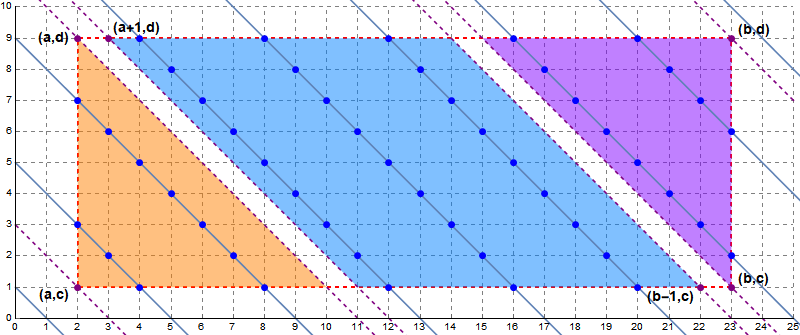
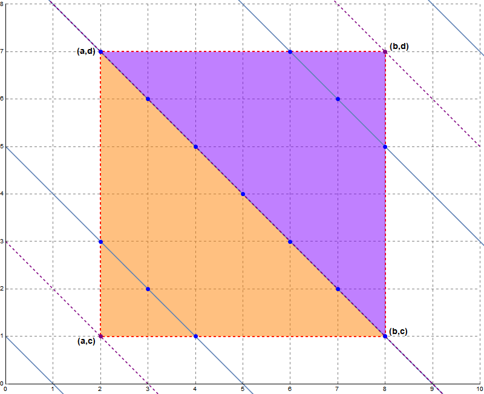

## Algorithm-optimization Crypto Master

by WEGFan

分类：crypto

---

### 题解

子怡姐姐说算法优化题算 crypto 那我就出一个好了 ~~（有内鬼，终止比赛）~~

首先分析 `calculate` 这个函数

外面是两层循环遍历

最里面的 `(i & j) + (i | j)` 实际上就是 `i + j`（根据真值表，`i | j` 等价于 `(i ^ j) + (i & j)`，所以 `(i & j) + (i | j)` 等价于 `(i ^ j) + ((i & j) << 1)`，而 `i ^ j` 可以看作是 `i` 和 `j` 不考虑进位时的加法结果，当对应二进制位都为 1 时，才产生进位，因此 `(i & j) << 1` 是进位产生的值，两者相加就是完整的加法结果）

接下来的 while 循环等价于 `t %= p`，所以最里面可以改写成

```cpp
if ((i + j) % p == m)
    ans++;
```

因此这个函数的作用是计算对于所有的 $a \le i \le b, c \le j \le d$ 满足 $(i + j) \mod p = m$ 的个数（假设 $a \le b, c \le d$）

由于贫穷的我们并没有 6 小时能跑 $1.94 * 10 ^ {18}$ 次运算的超算，所以这题考虑算法优化

（方法不唯一，可以搜索 flag 内容看别的方法）

如果我们把 $a$ 和 $b$ 当作 $x$ 轴上的数，$c$ 和 $d$ 当作 $y$ 轴上的数，那么因为 $(x + y) \mod p = m \Leftrightarrow x + y = kp + m \ (k \in \mathbb{Z}) \Leftrightarrow y = -x + kp + m \ (k \in \mathbb{Z})$，所以满足 $(x + y) \mod p = m$ 的 $(x, y)$ 可以看作是在由对角线顶点是 $(a, c)$ 和 $(b, d)$ 形成的矩形里面、且在方程为 $y = -x + kp + m \ (k \in \mathbb{Z})$ 的直线上的点（ ~~我也不知道我在说啥~~ 就是下图中的蓝色的点）



于是我们可以把满足条件的所有点分为三个部分：

- 橙色三角形部分（顶点为 $(a, c), (a, d), (a + d - c, c)$）
  - 由于每两条相邻直线之间的间隔距离是相等的，可以发现直线所经过的点是公差为 $p$ 的等差数列
  - 找到满足 $k_1 * p + m \ge a + c$ 中最小的 $k_1 = \lceil \frac{a + c - m}{p} \rceil$，和满足 $k_2 * p + m \le a + d$ 中最大的 $k_2 = \lfloor \frac{a + d - m}{p} \rfloor$，那么对于所有的 $k \in [k_1, k_2]$，直线都是穿过这个部分的
  - 于是可以算出 $k = k_1$ 时直线上的点数为 $s_1 = (k_1 * p + m - a) - c + 1$，这个部分总共有 $n_1 = k_2 - k_1 + 1$ 条直线
  - 根据等差数列求和公式，这个部分总共有 $\frac{s_1 + (s_1 + p * (n_1 - 1))}{2} * n_1$ 个点

- 紫色三角形部分（顶点为 $(b, d), (b, c), (b - d + c, d)$）
  - 同理，找到满足 $k_1 * p + m \ge b + c$ 中最小的 $k_1 = \lceil \frac{b + c - m}{p} \rceil$，和满足 $k_2 * p + m \le b + d$ 中最大的 $k_2 = \lfloor \frac{b + d - m}{p} \rfloor$
  - 于是可以算出 $k = k_2$ 时直线上的点数为 $s_2 = d - (k_2 * p + m - b) + 1$，这个部分总共有 $n_2 = k_2 - k_1 + 1$ 条直线
  - 根据等差数列求和公式，这个部分总共有 $\frac{s_2 + (s_2 + p * (n_2 - 1))}{2} * n_2$ 个点

- 剩下蓝色的平行四边形部分
  - 这个部分每条直线经过的点都是一样的
  - 找到满足 $k_1 * p + m \ge a + 1 + d$ 中最小的 $k_1 = \lceil \frac{a + 1 + d - m}{p} \rceil$，和满足 $k_2 * p + m \le b - 1 + c$ 中最大的 $k_2 = \lfloor \frac{b - 1 + c - m}{p} \rfloor$
  - 于是可以算出每条直线上的点数都为 $s_3 = d - c + 1$，这个部分总共有 $n_3 = k_2 - k_1 + 1$ 条直线
  - 所以这个部分总共有 $s_3 * n_3$ 个点

把三个部分的点数加起来即可，不过要注意如果算出来 $k_1 > k_2$，那么这个部分里面是没有点的

还有就是当 $d - c + 1 = b - a + 1$ 时，矩形会变成正方形，此时只有两个三角形的部分，且有一条线会重复计算，最后判断一下减掉即可



优化后的代码在 `std.c` 里，运行得到 flag `zsctf{4790_JusT_RaNdOm}`
